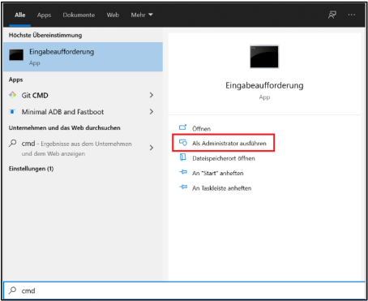
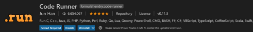

# KnackHaskell
<div id="top"></div>


<!-- PROJECT LOGO -->
<br />
<div align="center">
<h3 align="center">Knack in Haskell</h3>

  <p align="center">
    Dieses Projekt ist im Zeitraum von September bis Dezember 2021 im Modul "Weitere Programmiersprache" entstanden. Hierbei haben wir in der Programmiersprache Haskell das Kartenspiel Knack oder auch bekannt als Schwimmen implementiert.
    <br />
  </p>
</div>

<!-- TABLE OF CONTENTS -->
<details>
  <summary>Table of Contents</summary>
  <ol>
    <li>
      <a href="#regeln">Regeln</a>
      <ul>
        <li><a href="#allgemeines">Allgemeines</a></li>
        <li><a href="#karten">Karten</a></li>
        <li><a href="#wertigkeit-der-kartentypen">Wertigkeit der Kartentypen</a></li>
        <li><a href="#ablauf">Ablauf</a></li>
        <li><a href="#besonderheiten">Besonderheiten</a></li>
        <li><a href="#spielende">Spielende</a></li>
      </ul>
    </li>
    <li>
      <a href="#getting-started">Getting Started</a>
      <ul>
        <li><a href="#installation-chocolatey-windows">Installation Chocolatey (Windows)</a></li>
        <li><a href="#installation-der-haskell-plattform-windows">Installation der Haskell-Plattform (Windows)</a></li>
        <li><a href="#einrichten-von-haskell-in-visual-studio-code-windows">Einrichten von Haskell in Visual Studio Code (Windows)</a></li>
        <li><a href="#herunterladen-und-starten-des-programms-windows">Herunterladen und starten des Programms (Windows)</a></li>
      </ul>
    </li>
  </ol>
</details>


<!-- ABOUT THE PROJECT -->
## Regeln

### Allgemeines

* es wird mit 32 Karten gespielt (Skatblatt)
* 2-7 Spieler
<br />Ziel: Nicht die geringste Punktezahl haben.


<p align="right">(<a href="#top">back to top</a>)</p>

### Karten

* Karo
* Kreuz
* Pik
* Herz

<p align="right">(<a href="#top">back to top</a>)</p>

### Wertigkeit der Kartentypen

Karte | Wertigkeit
:---: | :---:
Ass | 11
Zehn | 10
Koenig | 10
Dame | 10
Bube | 10
Neun | 09
Acht | 08
Sieben | 07

<p align="right">(<a href="#top">back to top</a>)</p>

### Ablauf

* jeder Spieler erhält zu Beginn einen Kartenstapel bestehend aus 3 Karten
* der Karten-Ausgeber teilt sich selbst 2 Kartenstapel aus
    * wählt sich einen aus, welchen er angucken darf
    * anschließend entscheiden, ob er diesen behalten möchte oder auf "gut Glück" den anderen wählen (ohne anzuschauen)
* wenn ein Spieler an der Reihe ist, kann er entweder eine einzige Karte wählen, alle drei Karten oder gar keine (hierbei gibt es zwei Varianten)
    * wählt ein Spieler keine Karte, so kann er "schieben" (eine Runde aussetzen) oder "zumachen" (das Spiel in der nächsten Runde beenden (erst ab Runde 2 möglich))

<p align="right">(<a href="#top">back to top</a>)</p>

### Besonderheiten

* Feuer/Blitz:
    * drei gleichranige Karten zählen im Allgemeinen 30,5 Punkte
    * drei Asse sind ein "Super-Knack" und gewinnen immer
* schieben alle Spieler, so werden 3 neue Karten in die Mitte gelegt
* liegt in der Mitte eine Kombination aus 7/8/9, so werden 3 neue Karten in die Mitte gelegt

<p align="right">(<a href="#top">back to top</a>)</p>

### Spielende

* Spiel wird beendet, wenn ein Spieler zumacht, jedoch dürfen die anderen Spieler nochmal eine Runde weiterspielen
* Knack oder Super-Knack, so wird das Spiel sofort beendet

<p align="right">(<a href="#top">back to top</a>)</p>

<!-- ---------------------------------------------------------------- GETTING STARTED ---------------------------------------------------------------- -->
## Getting Started

Hier beschreiben wir, wie dieses Programm lokal ausführbar gemacht werden kann.

### Installation Chocolatey (Windows)

1. Eingabeaufforderung (cmd) als Admin ausführen <br />
2. Den Befehl aus dem Pastebin (https://pastebin.com/dqBB532d) kopieren und in die Kommandozeile (cmd) einfügen und dann ausführen.
```sh
   @"%SystemRoot%\System32\WindowsPowerShell\v1.0\powershell.exe" -NoProfile -InputFormat None -ExecutionPolicy Bypass -Command "[System.Net.ServicePointManager]::SecurityProtocol = 3072; iex ((New-Object System.Net.WebClient).DownloadString('https://community.chocolatey.org/install.ps1'))" && SET "PATH=%PATH%;%ALLUSERSPROFILE%\chocolatey\bin" 
   ```
3. Überprüfen, ob Chocolatey installiert ist mit:
  ```sh
  choco --version
  ```
  
<p align="right">(<a href="#top">back to top</a>)</p>

### Installation der Haskell-Plattform (Windows)

1. Folgenden Befehl in der cmd oder PowerShell eingeben:
  ```sh
  choco install haskell-dev
  ```
  Dabei kann es passieren das am Ende der Installation wiederholt ein
Systemupdate durchgeführt wird, ohne dass die Installation beendet wird. In
diesem Fall kann der Vorgang mit Strg + C in der Konsole beendet werden.

2. Schließen der Konsole und Überprüfen der Installation mit:
  ```sh
  ghc --version
  ```
  und 
  ```sh
  cabal --version
  ```
  
<p align="right">(<a href="#top">back to top</a>)</p>

### Einrichten von Haskell in Visual Studio Code (Windows)

1. Visual Studio Code herunterladen und installieren: [https://code.visualstudio.com/](https://code.visualstudio.com/)
2. Visual Studio Code starten
3. Unter Extensions (Strg + Shift + X) folgende Plugins installieren:
   1. Haskell<br />
   2. Code Runner <br />

<p align="right">(<a href="#top">back to top</a>)</p>

### Herunterladen und starten des Programms (Windows)

1. Herunterladen des Codes.
2. Code in Visual Studio Code öffnen.
3. Neues Terminal öffnen und folgendes ausführen:
  ```sh
  cabal run
  ```
  Dabei werden Inhalte heruntergeladen und anschließend sollte sich das Programm im Terminal darstellen lassen.

<p align="right">(<a href="#top">back to top</a>)</p>

<!-- 
README Template: https://github.com/othneildrew/Best-README-Template/blob/master/BLANK_README.md?plain=1
-->
